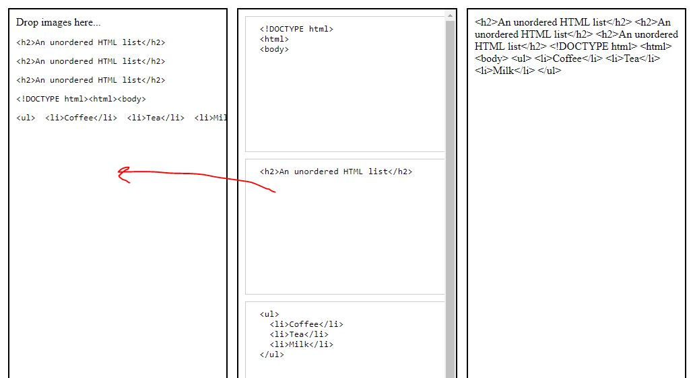

# Visor de Fragmentos de Código HTML Interactivo

## Acceso Rápido a la Aplicación
[Fragmentos de Código](https://xococode.github.io/Arrastables.github.io/)

## Descripción
Este proyecto es un visor de fragmentos de código HTML interactivo que permite a los usuarios arrastrar, soltar y visualizar fragmentos de código de forma dinámica. La interfaz divide la pantalla en tres secciones: el visor, la galería de fragmentos de código, y la sección de código compilado. Esto facilita la creación y gestión de estructuras HTML mediante la combinación de fragmentos predefinidos.

## Características

- **Arrastrar y Soltar**: Permite a los usuarios arrastrar fragmentos de código desde la galería al visor.
- **Galería de Fragmentos**: Incluye varios fragmentos de código HTML predefinidos que pueden ser insertados fácilmente.
- **Visualización en Tiempo Real**: Muestra una vista previa en tiempo real del código HTML ingresado.
- **Sección de Código Compilado**: Agrupa y muestra todo el código HTML insertado en un solo lugar.
- **Interactividad Mejorada**: Permite eliminaci�n de fragmentos de código mediante clics y teclas de borrado.
- **Estilos Personalizados**: Diseño limpio y responsive para una mejor experiencia de usuario.
- **Compatibilidad Multinavegador**: Funciona correctamente en los navegadores modernos principalmente: Chrome, Firefox, Edge y Safari.

